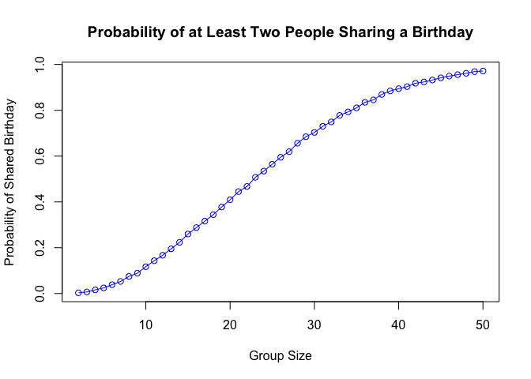

p8105_hw5_zf2352
================
Zhenkun Fang
2024-11-11

# Problem 1

``` r
duplicated_birthday = function(n) {
  
  birthdays = sample(1:365, n, replace = TRUE)
  
  return(length(birthdays) != length(unique(birthdays)))
}

duplicated_birthday(25)
```

    ## [1] TRUE

``` r
group_size = 2:50
probabilities = numeric(length(group_size))
simulations = 10000

for (i in seq_along(group_size)) {
  n = group_size[i]
  duplicates = replicate(simulations, duplicated_birthday(n))
  probabilities[i] = mean(duplicates)
}

results <- data.frame(GroupSize = group_size, Probability = probabilities)
print(results)
```

    ##    GroupSize Probability
    ## 1          2      0.0032
    ## 2          3      0.0069
    ## 3          4      0.0161
    ## 4          5      0.0247
    ## 5          6      0.0387
    ## 6          7      0.0528
    ## 7          8      0.0748
    ## 8          9      0.0890
    ## 9         10      0.1172
    ## 10        11      0.1433
    ## 11        12      0.1671
    ## 12        13      0.1951
    ## 13        14      0.2235
    ## 14        15      0.2599
    ## 15        16      0.2879
    ## 16        17      0.3161
    ## 17        18      0.3443
    ## 18        19      0.3778
    ## 19        20      0.4095
    ## 20        21      0.4450
    ## 21        22      0.4676
    ## 22        23      0.5073
    ## 23        24      0.5345
    ## 24        25      0.5645
    ## 25        26      0.5949
    ## 26        27      0.6192
    ## 27        28      0.6562
    ## 28        29      0.6848
    ## 29        30      0.7032
    ## 30        31      0.7302
    ## 31        32      0.7492
    ## 32        33      0.7778
    ## 33        34      0.7930
    ## 34        35      0.8107
    ## 35        36      0.8347
    ## 36        37      0.8454
    ## 37        38      0.8692
    ## 38        39      0.8846
    ## 39        40      0.8944
    ## 40        41      0.9033
    ## 41        42      0.9181
    ## 42        43      0.9236
    ## 43        44      0.9322
    ## 44        45      0.9417
    ## 45        46      0.9493
    ## 46        47      0.9556
    ## 47        48      0.9615
    ## 48        49      0.9688
    ## 49        50      0.9714

``` r
plot(group_size, probabilities, type = "o", col = "blue",
     xlab = "Group Size", ylab = "Probability of Shared Birthday",
     main = "Probability of at Least Two People Sharing a Birthday")
```

<!-- -->

The plot shows that as the group size increases from 2 to around 23, the
probability of at least two people sharing a birthday increases rapidly.
At a group size of approximately 23, the probability exceeds 0.5,
meaning that there’s a greater than 50% chance that at least two people
will share a birthday. The plot shows a steady increase in probability
up to around group size 40, after which the probability seems to plateau
near 1.

# Problem 2
