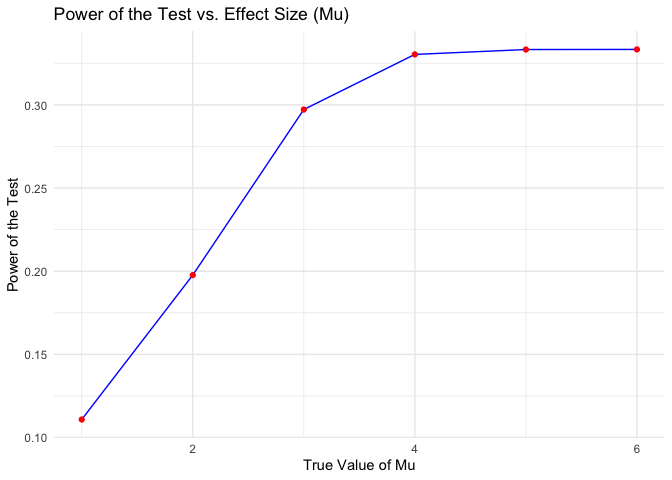
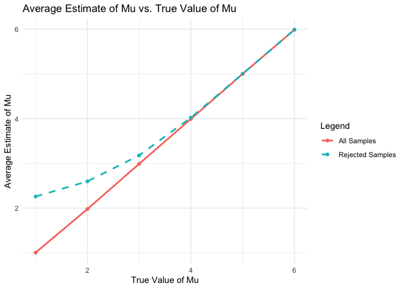
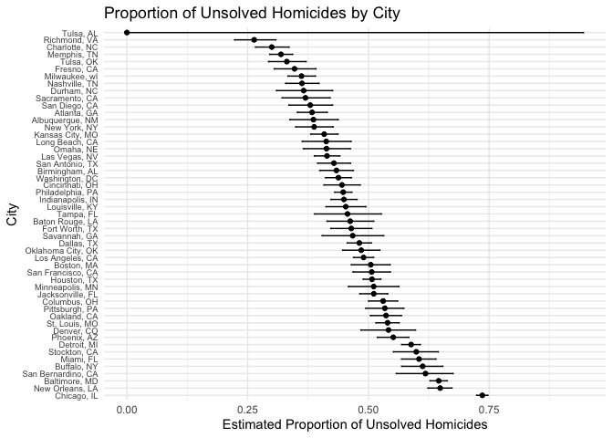

p8105_hw5_zf2352
================
Zhenkun Fang
2024-11-15

# Problem 1

``` r
duplicated_birthday = function(n) {
  
  birthdays = sample(1:365, n, replace = TRUE)
  
  return(length(birthdays) != length(unique(birthdays)))
}

duplicated_birthday(25)
```

    ## [1] TRUE

``` r
group_size = 2:50
probabilities = numeric(length(group_size))
simulations = 10000

for (i in seq_along(group_size)) {
  n = group_size[i]
  duplicates = replicate(simulations, duplicated_birthday(n))
  probabilities[i] = mean(duplicates)
}

results <- data.frame(GroupSize = group_size, Probability = probabilities)
print(results)
```

    ##    GroupSize Probability
    ## 1          2      0.0032
    ## 2          3      0.0069
    ## 3          4      0.0161
    ## 4          5      0.0247
    ## 5          6      0.0387
    ## 6          7      0.0528
    ## 7          8      0.0748
    ## 8          9      0.0890
    ## 9         10      0.1172
    ## 10        11      0.1433
    ## 11        12      0.1671
    ## 12        13      0.1951
    ## 13        14      0.2235
    ## 14        15      0.2599
    ## 15        16      0.2879
    ## 16        17      0.3161
    ## 17        18      0.3443
    ## 18        19      0.3778
    ## 19        20      0.4095
    ## 20        21      0.4450
    ## 21        22      0.4676
    ## 22        23      0.5073
    ## 23        24      0.5345
    ## 24        25      0.5645
    ## 25        26      0.5949
    ## 26        27      0.6192
    ## 27        28      0.6562
    ## 28        29      0.6848
    ## 29        30      0.7032
    ## 30        31      0.7302
    ## 31        32      0.7492
    ## 32        33      0.7778
    ## 33        34      0.7930
    ## 34        35      0.8107
    ## 35        36      0.8347
    ## 36        37      0.8454
    ## 37        38      0.8692
    ## 38        39      0.8846
    ## 39        40      0.8944
    ## 40        41      0.9033
    ## 41        42      0.9181
    ## 42        43      0.9236
    ## 43        44      0.9322
    ## 44        45      0.9417
    ## 45        46      0.9493
    ## 46        47      0.9556
    ## 47        48      0.9615
    ## 48        49      0.9688
    ## 49        50      0.9714

``` r
plot(group_size, probabilities, type = "o", col = "blue",
     xlab = "Group Size", ylab = "Probability of Shared Birthday",
     main = "Probability of at Least Two People Sharing a Birthday")
```

<!-- -->

The plot shows that as the group size increases from 2 to around 23, the
probability of at least two people sharing a birthday increases rapidly.
At a group size of approximately 23, the probability exceeds 0.5,
meaning that there’s a greater than 50% chance that at least two people
will share a birthday. The plot shows a steady increase in probability
up to around group size 40, after which the probability seems to plateau
near 1.

# Problem 2

``` r
n = 30
sigma = 5
alpha = 0.05

sim_mean_sd = function(n, mu, sigma) {
  
  sim_data = tibble(
    x = rnorm(n, mean = mu, sd = sigma),
  )
  
  t_test_result = t.test(sim_data$x, mu = 0)
  tidy_result = broom::tidy(t_test_result)
  
  sim_data |> 
    summarize(
      mu_hat = mean(x),
      sigma_hat = sd(x),
      p_value = tidy_result$p.value
    )
}
```

``` r
output = vector("list", 5000)

for (i in 1:5000) {
  output[[i]] = sim_mean_sd(n, mu = 0, sigma)
}

sim_results_0 = bind_rows(output)
summary(sim_results_0)
```

    ##      mu_hat           sigma_hat        p_value         
    ##  Min.   :-3.62067   Min.   :2.794   Min.   :0.0002505  
    ##  1st Qu.:-0.58969   1st Qu.:4.500   1st Qu.:0.2471349  
    ##  Median : 0.02392   Median :4.931   Median :0.4988702  
    ##  Mean   : 0.01847   Mean   :4.953   Mean   :0.4978360  
    ##  3rd Qu.: 0.64635   3rd Qu.:5.376   3rd Qu.:0.7404650  
    ##  Max.   : 3.14525   Max.   :7.120   Max.   :0.9999877

``` r
mu_values = 1:6
n_datasets = 5000
power_results = data.frame(mu = mu_values, power = numeric(length(mu_values)))


for (mu in mu_values) {
  p_values = replicate(n_datasets, sim_mean_sd(n, mu, sigma))
  power = mean(p_values < alpha)
  power_results[power_results$mu == mu, "power"] = power
}
```

``` r
ggplot(power_results, aes(x = mu, y = power)) +
  geom_line(color = "blue") +
  geom_point(color = "red") +
  labs(title = "Power of the Test vs. Effect Size (Mu)",
       x = "True Value of Mu",
       y = "Power of the Test") +
  theme_minimal()
```

<!-- -->

The power of the test increases as the true value of mu increases from 1
to 4. This indicates that as the effect size becomes larger, the
likelihood of correctly rejecting the null hypothesis improves. The
power seems to plateau around 0.33 as mu increases from 4 to 6. This
indicates that the test’s ability to detect a significant effect has
stabilized, and further increases in mu have little additional impact on
the power.

``` r
all_results = list()

for (mu in mu_values) {
  simulations = replicate(n_datasets, sim_mean_sd(n, mu, sigma), simplify = FALSE)
  df = bind_rows(simulations)
  df$true_mu = mu
  all_results[[as.character(mu)]] = df
}

# Combine all results into one data frame
all_results_df = bind_rows(all_results)

avg_mu_hat = all_results_df %>%
  group_by(true_mu) %>%
  summarize(mean_mu_hat = mean(mu_hat))

# Calculate the average of mu_hat for only those where the null hypothesis was rejected
avg_mu_hat_rejected = all_results_df %>%
  filter(p_value < alpha) %>%
  group_by(true_mu) %>%
  summarize(mean_mu_hat_rejected = mean(mu_hat))

# Merge the two datasets for plotting
plot_data = avg_mu_hat %>%
  left_join(avg_mu_hat_rejected, by = "true_mu")
```

``` r
ggplot(plot_data, aes(x = true_mu)) +
  geom_line(aes(y = mean_mu_hat, color = "All Samples"), size = 1) +
  geom_line(aes(y = mean_mu_hat_rejected, color = "Rejected Samples"), size = 1, linetype = "dashed") +
  geom_point(aes(y = mean_mu_hat, color = "All Samples")) +
  geom_point(aes(y = mean_mu_hat_rejected, color = "Rejected Samples")) +
  labs(title = "Average Estimate of Mu vs. True Value of Mu",
       x = "True Value of Mu",
       y = "Average Estimate of Mu",
       color = "Legend") +
  theme_minimal()
```

    ## Warning: Using `size` aesthetic for lines was deprecated in ggplot2 3.4.0.
    ## ℹ Please use `linewidth` instead.
    ## This warning is displayed once every 8 hours.
    ## Call `lifecycle::last_lifecycle_warnings()` to see where this warning was
    ## generated.

<!-- -->

When the true value of $\mu$ range from 1 to 3, the sample average of
$\hat{\mu}$ is not equal to the true value of mu. However, after
$\mu = 4$, mu hat is approximately equal to $\mu$.

This is because when $mu$ is between 1 and 4, the effect size is small,
and the power of the test is relatively low. This means that the test is
not very effective at distinguishing between the null hypothesis
($\mu = 0$) and the true value ($\mu > 0$). When $\mu$ is larger
(greater than 4), the power of the test is high, meaning most samples
reject the null hypothesis. This reduces selection bias, and as a
result, the average estimates for all samples and rejected samples
become equal.

# Problem 3

``` r
homicide <- read_csv("homicide-data.csv")
```

    ## Rows: 52179 Columns: 12
    ## ── Column specification ────────────────────────────────────────────────────────
    ## Delimiter: ","
    ## chr (9): uid, victim_last, victim_first, victim_race, victim_age, victim_sex...
    ## dbl (3): reported_date, lat, lon
    ## 
    ## ℹ Use `spec()` to retrieve the full column specification for this data.
    ## ℹ Specify the column types or set `show_col_types = FALSE` to quiet this message.

This dataset has 52179 rows and 12 columns, which provides comprehensive
information on homicide cases, including victim demographics (name, age,
race, sex), location details, and case outcomes.

``` r
homicide = homicide%>% 
  mutate(
    city_state = paste(city, state, sep = ", ")
  )

city_summary = homicide %>% 
  group_by(city_state) %>% 
  summarize(
    total_homicides = n(),
    unsolved_homicides = sum(disposition %in% c("Closed without arrest", "Open/No arrest"))
  )

print(city_summary)
```

    ## # A tibble: 51 × 3
    ##    city_state      total_homicides unsolved_homicides
    ##    <chr>                     <int>              <int>
    ##  1 Albuquerque, NM             378                146
    ##  2 Atlanta, GA                 973                373
    ##  3 Baltimore, MD              2827               1825
    ##  4 Baton Rouge, LA             424                196
    ##  5 Birmingham, AL              800                347
    ##  6 Boston, MA                  614                310
    ##  7 Buffalo, NY                 521                319
    ##  8 Charlotte, NC               687                206
    ##  9 Chicago, IL                5535               4073
    ## 10 Cincinnati, OH              694                309
    ## # ℹ 41 more rows

``` r
baltimore_data = homicide %>% 
  filter(city_state == "Baltimore, MD")

total_homicides <- nrow(baltimore_data)
unsolved_homicides <- sum(baltimore_data$disposition %in% c("Closed without arrest", "Open/No arrest"))

prop_test_result <- prop.test(unsolved_homicides, total_homicides)

prop_test_summary <- broom::tidy(prop_test_result)

prop_test_summary
```

    ## # A tibble: 1 × 8
    ##   estimate statistic  p.value parameter conf.low conf.high method    alternative
    ##      <dbl>     <dbl>    <dbl>     <int>    <dbl>     <dbl> <chr>     <chr>      
    ## 1    0.646      239. 6.46e-54         1    0.628     0.663 1-sample… two.sided

``` r
city_proportions <- city_summary %>%
  mutate(
    tidy_results = map2(unsolved_homicides, total_homicides, ~ 
                          prop.test(.x, .y) %>% tidy())
  ) %>%
  unnest(tidy_results) 
```

    ## Warning: There was 1 warning in `mutate()`.
    ## ℹ In argument: `tidy_results = map2(...)`.
    ## Caused by warning in `prop.test()`:
    ## ! Chi-squared approximation may be incorrect

``` r
print(city_proportions)
```

    ## # A tibble: 51 × 11
    ##    city_state    total_homicides unsolved_homicides estimate statistic   p.value
    ##    <chr>                   <int>              <int>    <dbl>     <dbl>     <dbl>
    ##  1 Albuquerque,…             378                146    0.386   19.1    1.23e-  5
    ##  2 Atlanta, GA               973                373    0.383   52.5    4.32e- 13
    ##  3 Baltimore, MD            2827               1825    0.646  239.     6.46e- 54
    ##  4 Baton Rouge,…             424                196    0.462    2.27   1.32e-  1
    ##  5 Birmingham, …             800                347    0.434   13.8    2.05e-  4
    ##  6 Boston, MA                614                310    0.505    0.0407 8.40e-  1
    ##  7 Buffalo, NY               521                319    0.612   25.8    3.73e-  7
    ##  8 Charlotte, NC             687                206    0.300  109.     1.41e- 25
    ##  9 Chicago, IL              5535               4073    0.736 1231.     1.28e-269
    ## 10 Cincinnati, …             694                309    0.445    8.11   4.41e-  3
    ## # ℹ 41 more rows
    ## # ℹ 5 more variables: parameter <int>, conf.low <dbl>, conf.high <dbl>,
    ## #   method <chr>, alternative <chr>

``` r
city_proportions = city_proportions %>%
  arrange(desc(estimate)) %>%
  mutate(city_state = factor(city_state, levels = city_state))

ggplot(city_proportions, aes(x = city_state, y = estimate)) +
  geom_point() +
  geom_errorbar(aes(ymin = conf.low, ymax = conf.high), width = 0.2) +
  coord_flip() +
  labs(
    title = "Proportion of Unsolved Homicides by City",
    x = "City",
    y = "Estimated Proportion of Unsolved Homicides"
  ) +
  theme_minimal() +
  theme(axis.text.y = element_text(size = 7))
```

<!-- -->
